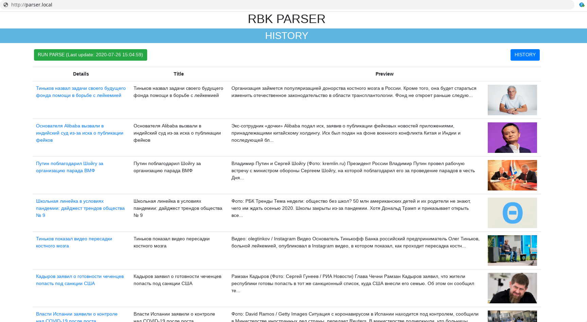
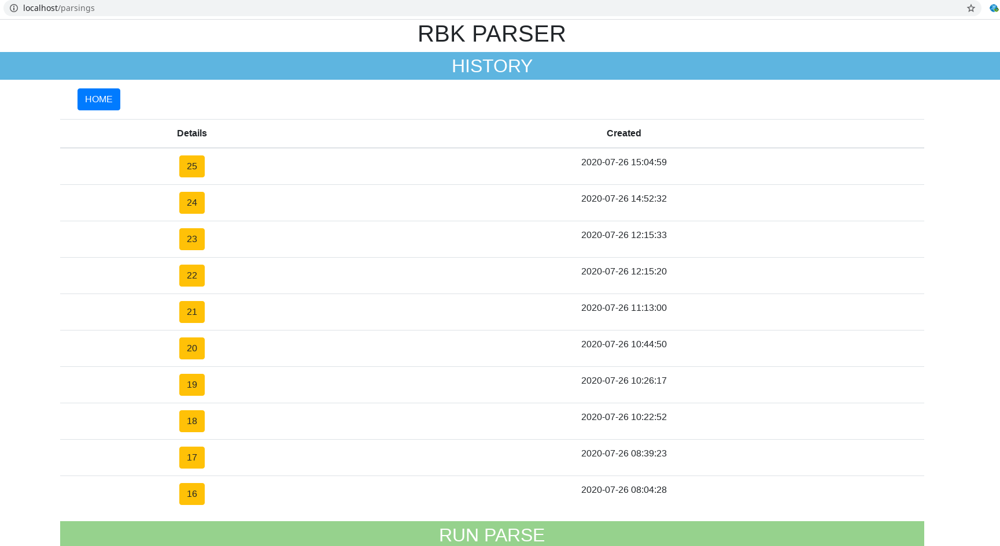
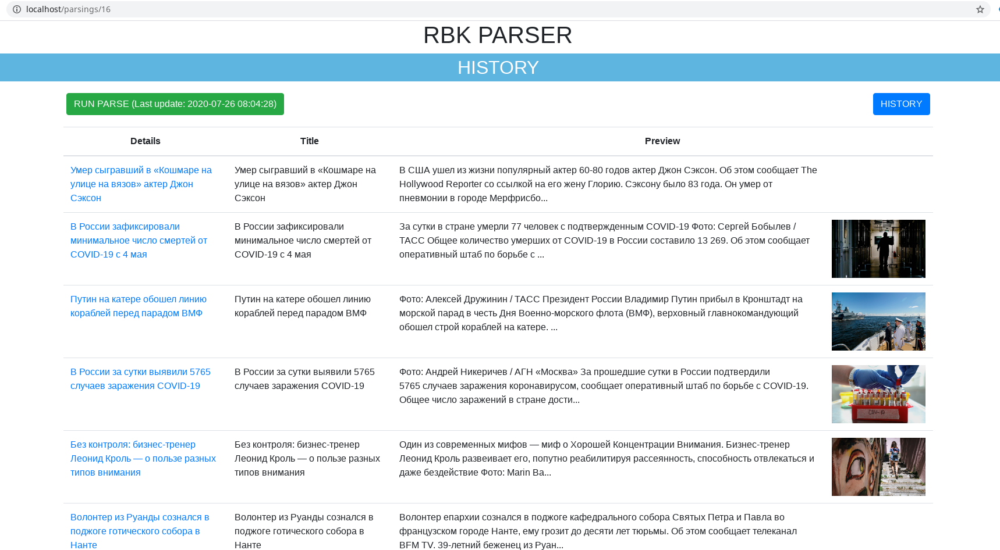
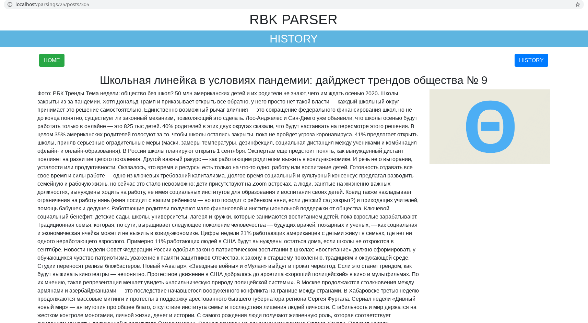

# PRESENTATION

## Main page:

- Here is current condition of last parsing process: list of parsed posts with links (detail pages of posts)
- [RUN PARSE BUTTON] executes new parsing. It works, but I made it for presentation only.
  - **USE THE CONSOLE COMMAND ```bin/console parser:run```**
- [HISTORY BUTTON] go to history of parsing processes, look below...

## History page

- Here is a simple list with dates of parsings and links on their detail pages, below...
  
## Detail page of parsing

- It is similar with main page, but the difference is a state of posts list on previous date. Let's go to detail post's page... 

## Detail page of post


---

# DEPLOY

## Steps on host:
### 0. Create any dir, and make deploy steps inside of it:
### 1. git clone https://github.com/gettads/parser-structure.git
### 2. rm -rf ./www/app
### 3. git clone https://github.com/gettads/parser-core.git ./www/app
### 4. docker-compose up -d --build
### 5. docker exec -it php bash 

## Steps inside of docker's contrainer (php-fpm):
### 6. cd /var/www/app
### 7. composer update
### 8. php bin/console doctrine:migrations:migrate

---

# Development environment

- Framework: Symfony 5.1 (PHP 7.4)
- Database: MySQL (8+) / Doctrine ORM
- Web-serever: NGINX
- Deploy: Docker / Docker-compose / Composer
- Frontend: TWIG / Bootstrap 4